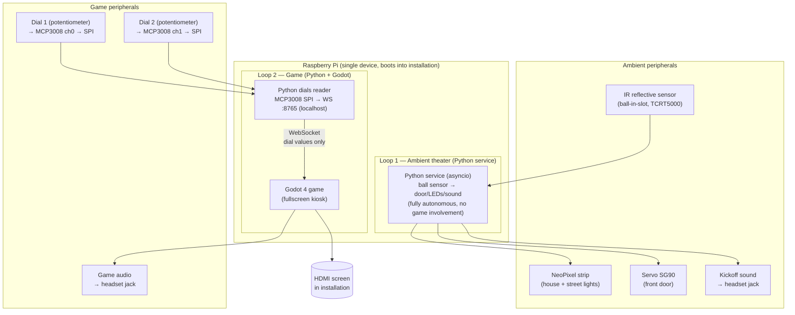

# M8 MUSE — Betondorp / Johan Cruijff Installation: Software Plan

## Context

This is the software-developer plan for one of the eight interactive tabletop installations for the **Amsterdam Museum — Amsterdam in Motion** project (theme: voetbal, object: young Johan Cruijff / Betondorp). The group has 8 weeks, a €100 hardware budget (mostly already covered — Pi + basics on hand), and must deliver a plug-and-play, internet-free installation of ~80×80×80 cm.

The chosen concept is two **independent** interactions sharing one tabletop installation, a miniature **house in Betondorp**:

1. **Ambient theater (ball).** The visitor places a small (3–4 cm) football into a slot in the street/yard. That triggers physical reactions only: front door opens, NeoPixels switch from "evening" to "match" colours, kickoff sound plays through the headset. Pulling the ball out reverses everything. The game on the screen **does not react to the ball at all** — it's purely a tangible "wake the house up" moment.
2. **The game (dials).** A **2-player PvP Pong-style football match**, themed in Johan Cruijff's Ajax/Netherlands era, runs continuously on a screen embedded in the installation. **Two physical turning dials** (rotary potentiometers) mounted on the installation control the two bumpers in classic Pong style. The game is always available — anyone can walk up and play, ball-in-slot or not. No AI, no single-player mode.

**No mobile app**: the experience is fully self-contained, no phone, no WiFi onboarding, no QR code.

**Feasibility:** Yes, very realistic — dropping the mobile app removed the WiFi/HTTP stack, and decoupling ball-from-game removes the cross-subsystem state machine. The remaining build is two small independent loops. With 2 software developers and 8 weeks: comfortable pace, lots of polish time. Remaining risks are (1) Godot 4 performance on the specific Pi model, (2) Pi auto-start into Godot kiosk on boot, and (3) physical mounting and wear-resistance of the dials (museum visitors will turn them hard) — all addressed in week 1–2 prototyping and week 6 physical integration.

**On the brief.** The brief asks for "top-down games like Mario/Zelda". Pong-themed-as-football is still a top-down 2D game with intuitive physical input — it satisfies the spirit of the brief, but flag this with the museum/lecturers early to confirm.

**Pure PvP.** The installation is signed "voor 2 spelers" — no AI fallback, no CPU bumper. A solo visitor either plays both dials (fun, surprisingly hard) or grabs a friend. Co-play makes for a more memorable museum moment for jongeren.

## Decisions locked from clarifying questions

- **Game engine:** Godot 4 (2D top-down).
- **Game style:** 2-player PvP Pong-style football, Cruijff/Ajax era theme. No AI / single-player mode. Game runs continuously and is always playable.
- **Ball ↔ game decoupling:** the ball-in-slot sensor drives **only** the physical installation (door, NeoPixels, kickoff sound). The game on the screen has no knowledge of the ball. The two subsystems share the same Pi but don't talk to each other.
- **Player input:** **Two rotary potentiometers** ("dials") mounted on the installation, read by the Pi through an MCP3008 SPI ADC (the Pi has no analog inputs of its own). Dial position is absolute → bumper Y position is absolute. No smoothing, no jitter.
- **Game runs on:** the Raspberry Pi, fullscreen on an HDMI screen embedded in the installation. The "tablet" requirement is satisfied by this screen.
- **Hardware:** Raspberry Pi + basics already owned. €100 budget covers dials, ADC, sensors, actuators, mounting.
- **Mobile app:** none. Installation is entirely self-contained; ball placement triggers actuator reactions automatically. Pi runs no WiFi AP, no HTTP server.

## Architecture

Two independent loops on one Pi:



**Why this shape:** the two interactions don't share state, so they don't need to share a process. Godot has no GPIO, so the dials still go through a thin Python reader → localhost WebSocket → game (one-way, dial values only). The ambient ball→actuator loop is a separate Python service that owns its own GPIO and doesn't touch the WebSocket at all. Independent testing, independent failure modes — if the game crashes the ambient theater still works, and vice versa.

**Audio mixing.** Both the ambient kickoff sound and the game audio go to the same headset jack. ALSA's default `dmix` plugin mixes them — confirm in week 1 that the Python service can play a short WAV via `aplay` or `pygame.mixer` while Godot is also playing audio. If `dmix` is fussy, run the kickoff sound through a tiny Godot-side player triggered by a separate UDP packet — but that re-couples the loops, so try the ALSA path first.

## Hardware bill of materials (target ≤ €60, leave ≥ €40 for mounting)

Confirm what you already own before buying:

| Part | Qty | Purpose | Notes |
|---|---|---|---|
| Raspberry Pi 4 (≥2 GB) or Pi 5 | 1 | Brain + game runner | Pi 5 preferred for Godot 4 |
| MicroSD 32 GB A1 | 1 | OS | |
| Rotary potentiometer, 10 kΩ linear, panel-mount with knob | 2 | Player 1 & Player 2 bumper control | Panel-mount with proper knob; visitors will be rough — pick a sturdy one (think arcade dial, not breadboard trim-pot) |
| MCP3008 8-channel SPI ADC | 1 | Reads the two analog dials | Pi has no analog inputs; MCP3008 is cheap and well-supported by `gpiozero` |
| TCRT5000 IR reflective module | 1 | Ball-in-slot detection (drives ambient theater only) | Pulling the ball out reverses the ambient reactions |
| KY-038 sound sensor (or electret + MAX9814) | 1 | Blow detection → in-game "Cruijff Turn" power-up | Game input only — does NOT trigger any physical reaction |
| WS2812B NeoPixel strip (1m, 30 LED) | 1 | House + street lighting | Drive via GPIO18 + level shifter or directly at 3.3V data with caution |
| SG90 micro servo | 1 | Front door opens | External 5 V supply, common ground |
| 3.5 mm audio out + headset | 1 | Game audio (brief requires headset) | Pi's onboard jack is fine |
| Small HDMI screen (7"–10") | 1 | Game display | If already owned, reuse |
| Jumper wires, breadboard, screw terminals, level shifter, 470 Ω resistor, 1000 µF cap | — | Wiring | Standard |

## Repository layout

```
/
├── ambient-service/         # Python: ball sensor → door/LEDs/sound. NO networking.
│   ├── service.py           # asyncio entry point, owns its GPIO
│   ├── hardware/
│   │   ├── ball_sensor.py
│   │   ├── leds.py
│   │   ├── door_servo.py
│   │   ├── sound_player.py  # plays kickoff WAV via aplay/pygame
│   │   └── fake.py
│   └── tests/
├── game-input/              # Python: dials + blow → WS server (localhost only)
│   ├── service.py
│   ├── hardware/
│   │   ├── dials.py         # MCP3008 → two pots
│   │   ├── blow_sensor.py
│   │   └── fake.py
│   ├── ws_server.py
│   ├── protocol.py
│   └── tests/
├── godot-game/              # Godot 4 project (shared with Game Artist)
│   └── scripts/ws_client.gd
├── deploy/
│   ├── systemd/
│   │   ├── betondorp-ambient.service
│   │   ├── betondorp-game-input.service
│   │   └── betondorp-kiosk.service
│   └── setup.sh             # one-shot Pi provisioning
└── docs/
    ├── protocol.md          # WebSocket message reference (game-input only)
    ├── wiring.md            # pinout + photos
    └── info-card.md         # text for museum sign
```

Two separate Python services means two separate `systemd` units that can crash and restart independently. The ambient service has no network surface at all — it's just GPIO in, GPIO out.

## WebSocket protocol (single source of truth — write `protocol.md` in week 1)

All messages are JSON. The `game-input` service binds to `127.0.0.1:8765` (no external clients). The **only** client is the Godot game. **One direction only — server → game.** The game never sends anything back.

**Server → game:**
- `{"type": "dial", "player": 1, "value": 0.0-1.0}` — Player 1 bumper position, 0 = top, 1 = bottom (or invert in game); sent at ~30 Hz, only when changed beyond a small dead-band to avoid noise
- `{"type": "dial", "player": 2, "value": 0.0-1.0}` — same, for Player 2
- `{"type": "blow", "intensity": 0.0-1.0}` — triggers in-game Cruijff Turn if intensity > threshold and power-up available

That's it. No ball events on this socket (the ambient service handles those locally). No game → server messages at all.

## Game design — Pong-style football, 2 players (always on)

**Core mechanic.** Side view of a football pitch styled as De Meer / Ajax era. Two bumpers, one per side. Each bumper's Y position is the **absolute angle of its dial**: turn the dial fully one way → bumper at top of pitch, the other way → bottom. Ball ricochets between bumpers and walls. Score when the ball passes the opponent's goal line.

**Always-on attract/play loop.** The game is always running on the screen. There is no "ball placed → match starts" hand-off — the ball is purely physical theater. The screen cycles between:

1. **Attract mode** (no dial activity for ≥10 s): a short Betondorp/Cruijff intro video loops, with an overlay prompt like "Draai aan de knoppen om te spelen" and tiny animated bumpers showing how the dials map. Score is hidden.
2. **Match mode** (either dial moves): attract video fades out, a fresh match starts with score 0–0. Two halves are played (see below).
3. **Result mode** (match ends): brief winner celebration (~8 s), winner avatar in Ajax kit, then back to attract.

If both players walk away mid-match, after ~20 s of zero dial movement the game abandons the match and returns to attract.

**Two interactive challenges (deliverable from Game Artist for "twee interactieve uitdagingen"):**

1. **First half — Normal Pong-football.** First to 3 goals wins the half. Standard physics, normal bumper width, normal ball speed. Both players use only the dials.
2. **Second half — Cruijff Turn round.** First to 3 goals wins the half. Same dials, but a second mechanic unlocks: **either** player can blow into the sound sensor to trigger a 3-second "Cruijff Turn" — their bumper widens or the ball briefly slows. Limited uses per half (e.g. 2 each), shown on-screen. **Purely on-screen — no LED reaction.**

Overall winner = whoever wins more halves (or by total goals if 1-1).

**No physical reactions from the game.** Goals, halftime, the Cruijff Turn, match end — all of these are screen-only events with game audio through the headset. The NeoPixels and door are owned exclusively by the ambient service and respond only to the ball.

### Ambient theater — ball reactions (autonomous, no game involvement)

Owned entirely by `ambient-service`. The Python state machine is trivial:

| Ball sensor transition | Ambient reaction |
|---|---|
| Ball inserted into slot (idle → present) | Servo opens front door over ~1 s; NeoPixels crossfade from "evening" (warm, dim) to "match" (bright, Ajax-tinted) over ~0.5 s; play kickoff whistle WAV |
| Ball removed (present → idle) | Servo closes door; NeoPixels crossfade back to "evening"; no sound |

Debounce: a transition only counts after the sensor reads stable for ≥150 ms (visitors will fidget).

**Input feel — Pong dials.** Potentiometers give absolute, low-noise readings; no smoothing required, but in `game-input/hardware/dials.py`:
- Sample at 50 Hz via `gpiozero.MCP3008(channel=0)` / `channel=1`.
- Apply a small dead-band (don't re-broadcast a `dial` event if the change is <1 % of the range) — saves WS traffic and avoids drift jitter at the bumper.
- Calibrate min/max in the installation (mechanical end-stops may not span the full 0.0–1.0 range) — store calibration in a config file, not hard-coded.
- Map dial value → bumper Y in the **game**, not the service, so the service stays a pure pass-through.

## Work split (2 devs default; expand to 3 if the group has the headcount)

- **Dev A — Pi backend & hardware.** Both Python services (`ambient-service` for ball/LEDs/door/sound; `game-input` for dials/blow + WS server), GPIO drivers, systemd auto-start for all three units, audio mixing on the headset jack, kiosk autostart for Godot. Owns `ambient-service/`, `game-input/`, and `deploy/`.
- **Dev B — Godot integration & game logic.** Pairs with Game Artist. Implements `ws_client.gd`, builds the always-on attract/play loop, the two halves' rules, dial-to-bumper mapping, blow-triggered Cruijff Turn. Owns `godot-game/scripts/` and `docs/info-card.md` with the museum.

If a 3rd dev is available, split out: **Dev C — Reliability & QA.** Owns the verification matrix, sensor calibration in the real enclosure, on-site testing with kids, debouncing, operator guide.

## 8-week schedule

| Week | Goal | Concrete deliverables |
|---|---|---|
| 1 | **Foundations.** Repo, hardware shortlist, environments. | Repo skeleton committed; both Python services boot in `--fake` mode; Godot 4 installed and "hello world" runs fullscreen on Pi HDMI; bench-test ball detection with TCRT5000 and the actual ball material; confirm ALSA can mix kickoff WAV (ambient) with Godot audio on the same headset jack; document `protocol.md`. |
| 2 | **Ambient theater end-to-end.** Ball owns its own loop. | `ambient-service` wired to real ball sensor, LED strip, servo, and kickoff sound: drop ball → door opens, LEDs go bright, sound plays; remove ball → door closes, LEDs dim. Runs standalone, no game involvement. Debounce tuned. |
| 3 | **Game input + dials online.** | MCP3008 wired, both dials read cleanly; `game-input` WS server emits real `dial` events at ~30 Hz; Godot `ws_client.gd` connects and renders both bumpers tracking the dials with no jitter; blow sensor emits `blow` events. |
| 4 | **First half playable.** | Normal Pong-football fully playable: dials control bumpers, ball physics + scoring work, first-to-3 logic correct; attract → match → result state machine cycles. |
| 5 | **Second half + auto-start.** | Cruijff Turn round: blow triggers per-player on-screen power-up with limited uses; Pi boots into running installation in ≤60 s without keyboard (all three units start on boot); recovery: pulling power and re-plugging restores everything; abandoned-match timeout returns game to attract. |
| 6 | **Physical integration.** | Hardware mounted inside the installation by the Ruimtelijk Vormgever; cable routing finalized; sensors calibrated in the real enclosure (lighting affects IR/sound); audio via headset jack works; first end-to-end visitor test. |
| 7 | **Polish & robustness.** | Debounce all sensors; brightness/audio levels tuned; museum info-card text submitted; idle video transitions are seamless; full 30-min "kids stress test" with two real visitors playing back-to-back. |
| 8 | **Hand-off.** | Final on-site install at museum; written one-page operator guide (how to power on/off, what to do if it hangs); 1–2 days buffer for last-minute fixes. |

## Critical files / commands the implementer needs

- `ambient-service/service.py` — asyncio entry point. Owns ball sensor + LEDs + servo + kickoff sound. No WS, no network. State machine: `idle ↔ ball_present`.
- `game-input/service.py` — asyncio entry point. Owns dials (MCP3008) + blow sensor. WS server on `127.0.0.1:8765`, one direction (server → game).
- `{ambient-service,game-input}/hardware/fake.py` — scripted events so each service is developable on a laptop without the Pi.
- `game-input/protocol.py` — Pydantic models or `TypedDict`s for every message. Mirror in `godot-game/scripts/ws_client.gd` (keep `docs/protocol.md` as the human-readable spec).
- `deploy/setup.sh` — idempotent provisioning: apt install, copy systemd units, set Godot kiosk autostart.
- `deploy/systemd/betondorp-ambient.service` — `Type=simple`, `Restart=always`, runs `ambient-service` at boot. Independent of the others.
- `deploy/systemd/betondorp-game-input.service` — `Type=simple`, `Restart=always`, runs `game-input` before graphical target.
- `deploy/systemd/betondorp-kiosk.service` — starts Godot fullscreen after X is ready; depends on `betondorp-game-input.service`.

## Verification — how to know it actually works

A working installation must pass **all** of these, run by someone who didn't build it:

1. **Cold-start.** Plug in power. Within 60 s the screen shows the looping attract video, and the house is in "evening" (warm, dim) lighting with the door closed. No keyboard touched.
2. **Ball-placed ambient reaction.** Drop the ball into the kickoff slot — **independent of any game state:** front door servo opens, NeoPixels switch from "evening" to "match" colours, kickoff whistle plays through the headset. The screen does not change.
3. **Ball removed.** Pull the ball out — door closes, LEDs return to "evening", no sound. The screen still does not change.
4. **Dial control.** Turn Dial 1 across its full range — Player 1's bumper tracks the full pitch height, no jitter when the dial is held still. Same for Dial 2 and Player 2. Both dials work simultaneously. **No ball in slot required.**
5. **Attract → match.** From the attract video, turn either dial — match starts immediately at 0–0, regardless of ball state.
6. **Goal scored.** Score a goal — on-screen animation and goal horn through the headset. **No physical reaction** (LEDs and door do not respond).
7. **Cruijff Turn.** Blow on the sound sensor during the second half — on-screen power-up animation plays, bumper widens (or ball slows) for ~3 seconds, uses counter decrements. **No physical reaction.**
8. **Abandoned match.** Walk away mid-match for 20 s; game returns to attract on its own. Lights/door state is unaffected.
9. **Subsystem independence.** Kill `betondorp-game-input.service` — ambient theater still reacts to the ball. Kill `betondorp-ambient.service` — game still plays normally. (systemd should auto-restart both within seconds.)
10. **Hard reset.** Yank the power cord. Plug back in. Item #1 happens again.
11. **No internet, no WiFi.** Confirm with `nmcli`/`iw` that the Pi has no WiFi enabled at all. The installation is fully offline.
12. **Headset audio only.** Pull headset out; no sound bleeds from the installation (brief requirement: audio only via headset). Both kickoff sound and game audio share the jack.

Local-dev verification (without Pi):
- `python ambient-service/service.py --fake` simulates ball-in/ball-out and prints what the door/LEDs/sound would do.
- `python game-input/service.py --fake` emits scripted dial/blow events.
- Open Godot project on laptop, point WS client at `ws://localhost:8765` — game reacts to the fake events.

## Open questions to resolve in week 1 (not blocking the plan)

- **Confirm with lecturers/museum** that Pong-style football is acceptable interpretation of "top-down like Mario/Zelda" in the brief. Do this in week 1 so there's time to pivot if not.
- **Confirm decoupling is OK with the brief.** Some teaching staff may expect the physical interaction to "do something visible in the game". If they push back, the cheapest re-coupling is to broadcast a `ball_present` boolean over the WS for purely cosmetic on-screen effects (e.g. a tiny ball icon in the corner) — the ambient service stays autonomous.
- Exact Pi model (4 vs 5) — affects Godot 4 performance margin. Decide before week-2 game prototype.
- Final ball material/colour — affects IR sensor threshold; calibrate with the real ball in week 1.
- **Dial mounting** — where exactly on the installation the two dials live (height, spacing, label "Speler 1" / "Speler 2"). Coordinate with Ruimtelijk Vormgever in week 1; they affect the carpentry.
- **Dial type** — confirm rotary potentiometer (absolute) vs. rotary encoder (relative). Plan assumes potentiometers, which are simpler and feel right for Pong.
- **ALSA mixing** — verify on day 1 that the kickoff WAV and Godot audio can both play simultaneously through the headset jack via `dmix`. If not, swap to a single audio owner (probably Godot) and have the ambient service trigger sounds through a localhost UDP packet.